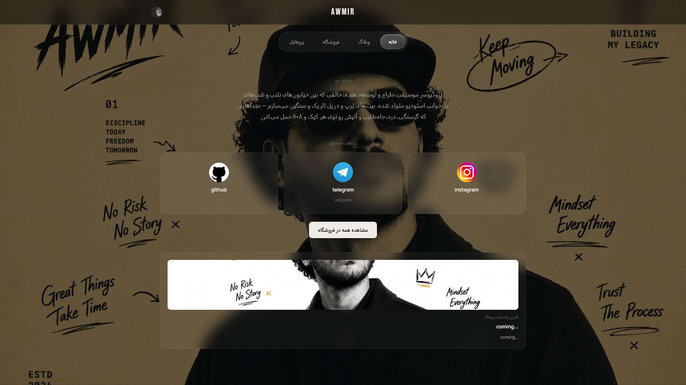
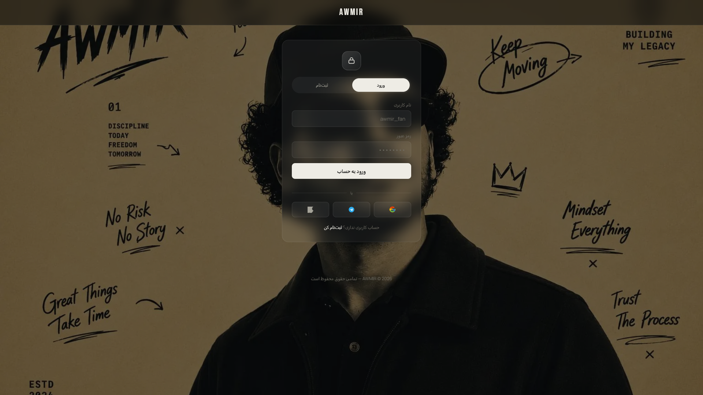
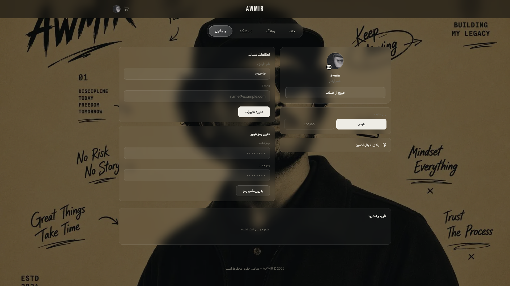
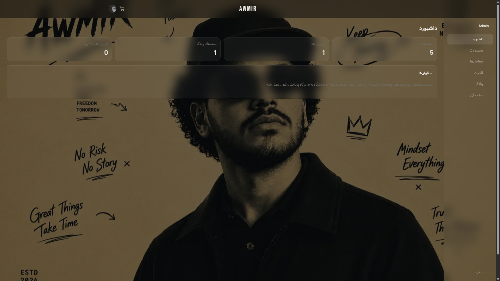
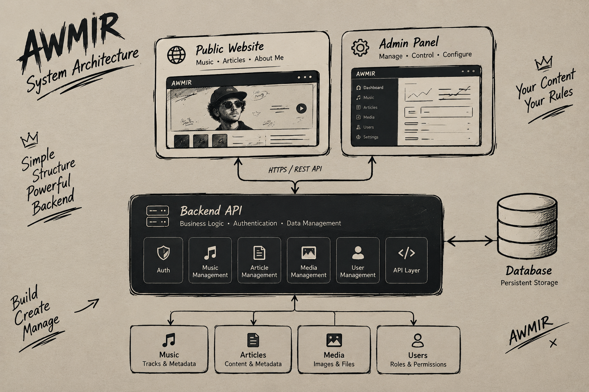

<div align="center">

# AWMIR.IR

### پلتفرم شخصی موسیقی و محتوا

**موسیقی · محتوا · هویت · بک‌اند · مدیریت**

<br>

<a href="https://awmir.ir">
  
</a>
&nbsp;
<a href="./README.md">
  
</a>

</div>

---

<div align="center">



</div>

---

## درباره AWMIR

**AWMIR.IR** یک پلتفرم شخصی مبتنی بر **موسیقی، هویت، محتوا و یک سیستم مدیریتی اختصاصی متصل به بک‌اند** است.

AWMIR به‌جای پیروی از ساختار یک وب‌سایت شرکتی معمولی یا یک پلتفرم رسانه‌ای سنتی، به‌عنوان یک تجربه دیجیتال یکپارچه طراحی شده است؛ جایی که موسیقی، محتوای شخصی، هویت بصری و زیرساخت فنی در قالب یک سیستم واحد با یکدیگر کار می‌کنند.

این پلتفرم مجموعه‌ای از قابلیت‌های زیر را در کنار یکدیگر قرار می‌دهد:

* 🎵 تجربه موسیقی و صوت
* ✍️ مقالات و محتوای شخصی
* 👤 هویت و معرفی شخصی
* ⚙️ زیرساخت بک‌اند اختصاصی
* 🛠️ سیستم مدیریت اختصاصی
* 🗄️ مدیریت و ذخیره‌سازی پایدار داده‌ها

AWMIR هم یک **پلتفرم دیجیتال واقعی** و هم یک **پروژه توسعه Full-Stack** است که با تمرکز بر ساخت یک تجربه وب شخصی، محتوایی و قابل توسعه شکل گرفته است.

---

# پلتفرم

AWMIR چندین تجربه مختلف را در قالب یک پلتفرم شخصی واحد ترکیب می‌کند.

### موسیقی

محیطی اختصاصی برای کشف و گوش دادن به موسیقی‌های منتشرشده در پلتفرم.

### محتوا

لایه انتشار شخصی برای مقالات، نوشته‌ها و محتوای مرتبط با پروژه‌ها.

### هویت

فضایی دیجیتال برای معرفی سازنده، فعالیت‌ها، علایق و هویت بصری.

### مدیریت

یک محیط مدیریتی اختصاصی برای کنترل محتوا و تنظیمات پلتفرم.

---

# تجربه عمومی

بخش عمومی AWMIR بر پایه چهار مفهوم اصلی شکل گرفته است:

**هویت · فضا · موسیقی · داستان**

رابط کاربری عمداً به‌گونه‌ای طراحی شده که شبیه یک CMS عمومی یا یک وب‌سایت شرکتی معمولی نباشد.

---

## صفحه اصلی

<div align="center">


</div>

صفحه اصلی، نقطه ورود اصلی به تجربه AWMIR است.

این صفحه هویت بصری پلتفرم را معرفی کرده و دسترسی به محتوای ویژه، موسیقی و بخش‌های اصلی وب‌سایت را فراهم می‌کند.

---

## ورود و ثبت‌نام

<div align="center">



</div>

بخش ورود و ثبت‌نام که به پایگاه داده متصل است و اطلاعات حساب کاربران را به‌صورت امن مدیریت و ذخیره می‌کند.

---

## پروفایل

<div align="center">



</div>

بخش پروفایل که کاربران می‌توانند اطلاعات و تنظیمات حساب خود را مدیریت و شخصی‌سازی کنند.

از جمله قابلیت‌های این بخش می‌توان به ویرایش اطلاعات حساب، تغییر نام کاربری و رمز عبور و تغییر زبان سایت اشاره کرد.

---

# مدیریت

## سیستم پشت AWMIR

وب‌سایت عمومی تنها یکی از لایه‌های پلتفرم AWMIR است.

در پشت رابط کاربری، یک سیستم مدیریت اختصاصی قرار دارد که برای کنترل متمرکز محتوا و تنظیمات پلتفرم طراحی شده است.

---

## داشبورد مدیریت

<div align="center">



</div>

داشبورد مدیریت به‌عنوان محیط مرکزی کنترل AWMIR عمل می‌کند.

بسته به وضعیت فعلی توسعه، سیستم مدیریت می‌تواند قابلیت‌هایی برای مدیریت بخش‌هایی مانند موارد زیر ارائه دهد:

* موسیقی
* مقالات
* رسانه‌ها
* محتوای ویژه
* تنظیمات پلتفرم
* محتوای موجود
* عملیات مدیریتی

هدف این سیستم، متمرکز کردن مدیریت محتوا و جداسازی آن از تجربه عمومی وب‌سایت است.

---

# معماری سیستم

<div align="center">



</div>

AWMIR از یک معماری لایه‌ای استفاده می‌کند که تجربه عمومی، پنل مدیریت، منطق برنامه و داده‌های پایدار را از یکدیگر جدا می‌کند.

```text
وب‌سایت عمومی ──┐
                │
                ▼
               API
                │
                ▼
             بک‌اند
                │
                ▼
             دیتابیس
                ▲
                │
پنل مدیریت ─────┘
```

### وب‌سایت عمومی

تجربه‌ای که بازدیدکنندگان برای دسترسی به موسیقی، محتوا و اطلاعات شخصی با آن تعامل دارند.

### پنل مدیریت

محیطی کنترل‌شده برای مدیریت پلتفرم و انجام عملیات مرتبط با محتوا.

### API و بک‌اند

مسئول ارتباطات، منطق برنامه، احراز هویت و عملیات اصلی پلتفرم.

### دیتابیس

مسئول ذخیره‌سازی پایدار اطلاعات و محتوای مورد استفاده پلتفرم.

این جداسازی باعث می‌شود لایه نمایش از منطق برنامه و مدیریت داده‌ها مستقل باقی بماند.

---

# اصول معماری

AWMIR بر اساس چند اصل اصلی ساخته شده است:

### جداسازی مسئولیت‌ها

نمایش، منطق برنامه، مدیریت و داده‌ها به‌عنوان مسئولیت‌های مستقل در نظر گرفته شده‌اند.

### مدیریت متمرکز

محتوای پلتفرم از طریق یک محیط مدیریتی اختصاصی کنترل می‌شود.

### محتوای مبتنی بر بک‌اند

محتوا می‌تواند بدون وابستگی مستقیم به نحوه نمایش عمومی مدیریت شود.

### قابلیت توسعه

معماری AWMIR می‌تواند هم‌زمان با اضافه شدن قابلیت‌های جدید توسعه پیدا کند.

### قابلیت نگهداری

جداسازی رابط‌ها، منطق بک‌اند و داده‌ها، نگهداری و توسعه آینده پلتفرم را ساده‌تر می‌کند.

---

# احراز هویت و امنیت

قابلیت‌های مدیریتی از طریق احراز هویت و مجوزهای دسترسی از تجربه عمومی کاربران جدا می‌شوند.

فرآیند مفهومی سیستم به شکل زیر است:

```text
مدیر
 │
 ▼
احراز هویت
 │
 ▼
مجوز دسترسی
 │
 ▼
پنل مدیریت
 │
 ▼
بک‌اند
```

محیط‌های Production باید از استانداردهای امنیتی متداول استفاده کنند، از جمله:

* محافظت از مسیرهای مدیریتی
* اعتبارسنجی سمت سرور
* مدیریت امن متغیرهای محیطی
* مدیریت ایمن فایل‌ها
* محافظت از دیتابیس
* HTTPS
* محدودسازی درخواست‌ها
* هدرهای امنیتی
* ثبت رویدادها و لاگ‌ها
* به‌روزرسانی وابستگی‌ها
* تهیه نسخه پشتیبان

---

# داده‌ها

لایه داده AWMIR چند بخش اصلی را پوشش می‌دهد:

| بخش      | کاربرد                            |
| -------- | --------------------------------- |
| موسیقی   | آهنگ‌ها و اطلاعات مرتبط با موسیقی |
| مقالات   | محتوای نوشتاری و شخصی             |
| رسانه‌ها | تصاویر، فایل‌ها و سایر Assetها    |
| مدیریت   | دسترسی مدیریتی و تنظیمات پلتفرم   |

ساختار دقیق پیاده‌سازی و Schema دیتابیس می‌تواند هم‌زمان با توسعه پلتفرم تغییر کند.

---

# چرا بک‌اند اختصاصی؟

AWMIR از یک بک‌اند اختصاصی استفاده می‌کند تا کنترل مستقیم‌تری روی ساختار و رفتار پلتفرم داشته باشد.

به‌جای وابستگی کامل به یک CMS عمومی، پلتفرم می‌تواند ساختارهای اختصاصی خود را برای موارد زیر تعریف کند:

* ساختار داده‌ها
* منطق تجاری
* فرآیندهای مدیریت محتوا
* تجربه پنل مدیریت
* رفتار API
* مدل احراز هویت
* قابلیت‌های اختصاصی پلتفرم
* یکپارچه‌سازی‌های آینده

به همین دلیل، بک‌اند در AWMIR تنها یک سرویس پشت صحنه نیست؛ بلکه بخشی جدایی‌ناپذیر از خود محصول محسوب می‌شود.

---

# فلسفه طراحی

AWMIR عمداً از ظاهر یک وب‌سایت شرکتی معمولی یا CMS سنتی فاصله می‌گیرد.

تجربه عمومی بر پایه این مفاهیم شکل گرفته است:

**هویت**

**موسیقی**

**فضا**

**داستان**

در مقابل، تجربه مدیریتی بر این مفاهیم تمرکز دارد:

**کنترل**

**ساختار**

**محتوا**

**مدیریت**

این جداسازی باعث می‌شود رابط عمومی، آزاد، بصری و immersive باقی بماند؛ در حالی که زیرساخت سیستم منظم، ساختاریافته و قابل نگهداری است.

---

# مسیر بصری

هویت بصری AWMIR بر پایه یک سبک دیجیتال مدرن و متمایز شکل گرفته است.

زبان طراحی پروژه بر موارد زیر تمرکز دارد:

* رابط‌های مینیمال
* چیدمان‌های immersive
* هویت بصری قدرتمند
* تعاملات مرتبط با موسیقی
* سلسله‌مراتب واضح اطلاعات
* تایپوگرافی مدرن
* تعاملات نرم و روان
* برندینگ شخصی
* ارائه ساختاریافته محتوا

هدف تنها ساخت یک وب‌سایت مدرن نیست؛ بلکه ایجاد یک محیط دیجیتال است که با هویت و فضای کلی پروژه ارتباط داشته باشد.

---

# پروژه مرجع

AWMIR می‌تواند به‌عنوان یک نمونه عملی برای توسعه‌دهندگانی که قصد ساخت پلتفرم‌های شخصی مشابه دارند نیز مورد استفاده قرار گیرد.

این پروژه نشان می‌دهد که چگونه یک وب‌سایت شخصی می‌تواند به یک پلتفرم دیجیتال کامل تبدیل شود:

```text
وب‌سایت شخصی
       +
سیستم موسیقی
       +
سیستم محتوا
       +
بک‌اند اختصاصی
       +
دیتابیس
       +
پنل مدیریت
```

همین مفاهیم می‌توانند برای پروژه‌هایی مانند موارد زیر نیز مورد استفاده قرار گیرند:

* وب‌سایت هنرمندان
* پلتفرم‌های موسیقی
* وب‌سایت تولیدکنندگان محتوا
* وب‌سایت‌های شخصی و Portfolio
* پلتفرم‌های انتشار محتوا
* وب‌سایت‌های محتوایی
* پروژه‌های CMS اختصاصی
* پلتفرم‌های دیجیتال شخصی

AWMIR قرار نیست یک معماری عمومی و مناسب برای تمام پروژه‌ها باشد.

این پروژه یک نمونه عملی از ساخت یک پلتفرم شخصی مبتنی بر بک‌اند و سیستم مدیریت اختصاصی است.

---

# مستندات

مستندات بصری پروژه به‌صورت ساده و متمرکز نگهداری می‌شوند.

```text
docs/
└── screenshots/
    ├── home.png
    ├── music.png
    ├── player.png
    ├── admin.png
    └── architecture.png
```

این پنج تصویر بخش‌های اصلی پلتفرم را نمایش می‌دهند:

**تجربه عمومی → موسیقی → پلیر → مدیریت → معماری**

---

# نقشه راه

توسعه آینده پروژه می‌تواند شامل موارد زیر باشد:

* [ ] گسترش سیستم تحلیل و آمار
* [ ] ایجاد سطوح دسترسی دقیق‌تر برای مدیران
* [ ] مدیریت پیشرفته‌تر رسانه‌ها
* [ ] بهبود فرآیندهای مدیریت محتوا
* [ ] توسعه قابلیت‌های موسیقی
* [ ] گسترش قابلیت‌های API
* [ ] بهبود عملکرد
* [ ] استقرار خودکار
* [ ] توسعه کنترل‌های امنیتی
* [ ] گسترش مستندات فنی

---

# وب‌سایت

<div align="center">

### <a href="https://awmir.ir">AWMIR.IR</a>

پلتفرم شخصی موسیقی و محتوا

</div>

---

# پروژه

**AWMIR.IR**

**پلتفرم شخصی موسیقی و محتوا**

ساخته‌شده بر پایه:

**موسیقی · محتوا · هویت · بک‌اند · مدیریت**

---

<div align="center">

### AWMIR

**بیشتر از یک وب‌سایت.**

<br>

<a href="https://awmir.ir">وب‌سایت</a>
 ·  <a href="./README.md">English README</a>

</div>
